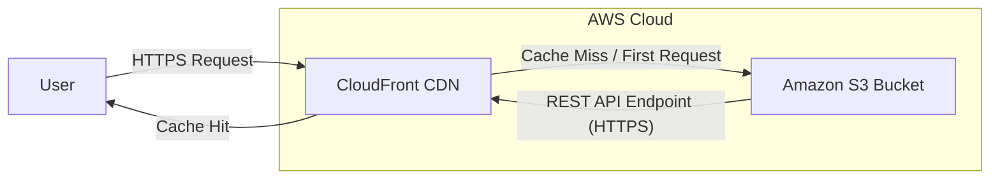

# 🚀 AWS S3 & CloudFront Static Website Deployment

This project provides a simple yet robust Terraform configuration to host a static website on Amazon S3 and deliver its content globally via Amazon CloudFront. This setup is ideal for personal portfolios, simple marketing sites, or any static content that requires high availability, scalability, and fast delivery.

## ✨ Features

* **Static Website Hosting on S3:** Leverages S3's native static website hosting capabilities to store and serve HTML, CSS, JavaScript, and other static assets.
* **Global Content Delivery (CDN):** Utilizes Amazon CloudFront to cache content at edge locations worldwide, significantly reducing latency and improving loading speeds for global users.
* **HTTPS Enforcement:** CloudFront is configured to serve content securely over HTTPS, ensuring data encryption in transit.
* **Serverless Architecture:** Both S3 and CloudFront are fully managed serverless services, eliminating the need for server provisioning, patching, or scaling.
* **Cost-Effective:** Designed to fit within AWS Free Tier limits for initial usage and learning purposes.

## 🏗️ Architecture Overview

The architecture is straightforward:

1. User Request: A user's browser initiates an HTTPS request to the CloudFront distribution's domain name.

2. CloudFront Cache Check: CloudFront checks its global edge cache.

3. Cache Hit: If the content is cached (cache hit), it's served directly to the user from the nearest edge location for blazing-fast response times.

4. Cache Miss: If the content is not in the cache (cache miss) or it's a first request, CloudFront forwards the request to the S3 bucket.

5. S3 as Origin: The S3 bucket serves the requested static file. CloudFront fetches the content from S3 using its REST API endpoint over HTTPS.

6. Content Delivery & Caching: CloudFront serves the content to the user and caches it at the edge location for future requests.

## 🚀 Getting Started ##
These instructions will get you a copy of the project up and running on your AWS account.

### Prerequisites ###
- AWS Account: An active AWS account.

- AWS CLI/Credentials: AWS CLI configured with credentials that have sufficient permissions to create S3 buckets, S3 bucket policies, and CloudFront distributions (AmazonS3FullAccess and CloudFrontFullAccess are generally sufficient for this project).

- Terraform: Install Terraform (v1.0.0 or higher recommended).

### Deployment Steps ###
1. Clone the Repository:
    
        git clone [https://github.com/YOUR_USERNAME/YOUR_REPO_NAME.git]  (https://github.com/YOUR_USERNAME/YOUR_REPO_NAME.git)
        cd YOUR_REPO_NAME # Navigate into your project directory
   
    (Remember to replace YOUR_USERNAME and YOUR_REPO_NAME with your actual GitHub details).

2. Initialize Terraform:

        terraform init
    This command downloads the necessary providers and initializes the working directory.

3. Review the Plan:

        terraform plan
    This command shows you what resources Terraform will create, modify, or destroy. Review it carefully to ensure it aligns with your expectations.

4. Apply the Configuration:

        terraform apply
    Type yes when prompted to confirm the deployment. Terraform will provision the S3 bucket and CloudFront distribution. This process can take 15-20 minutes for CloudFront to fully deploy globally.

5. Access Your Website:
    Once terraform apply completes successfully, Terraform will output the CloudFront distribution's domain name. You can access your static website by navigating to this URL in your web browser.

### 🧹 Cleaning Up Resources ###
To avoid incurring ongoing AWS costs, you can destroy the deployed resources when they are no longer needed:

1. Navigate to your project directory:

        Bash
        
        cd YOUR_REPO_NAME
2. Destroy resources:

        Bash
        
        terraform destroy
    Type yes when prompted to confirm the destruction of resources. This will remove the S3 bucket and the CloudFront distribution.
---

### ⚠️ Important Notes ###
- S3 Bucket Names: S3 bucket names must be globally unique. If deployment fails due to a name conflict, Terraform's random_string resource usually handles this.

- Public Access Blocks (BPA): For this public static website, account-level and bucket-level S3 Block Public Access settings need to allow public policies. This configuration is handled by Terraform.

- CloudFront Deployment Time: CloudFront distributions take a significant amount of time to deploy and propagate changes globally. Be patient during the terraform apply process.
---
### 🤝 Contributing ###

Feel free to fork this repository, open issues, or submit pull requests.

---
### 📄 License ###
This project is open-source and available under the MIT License.

